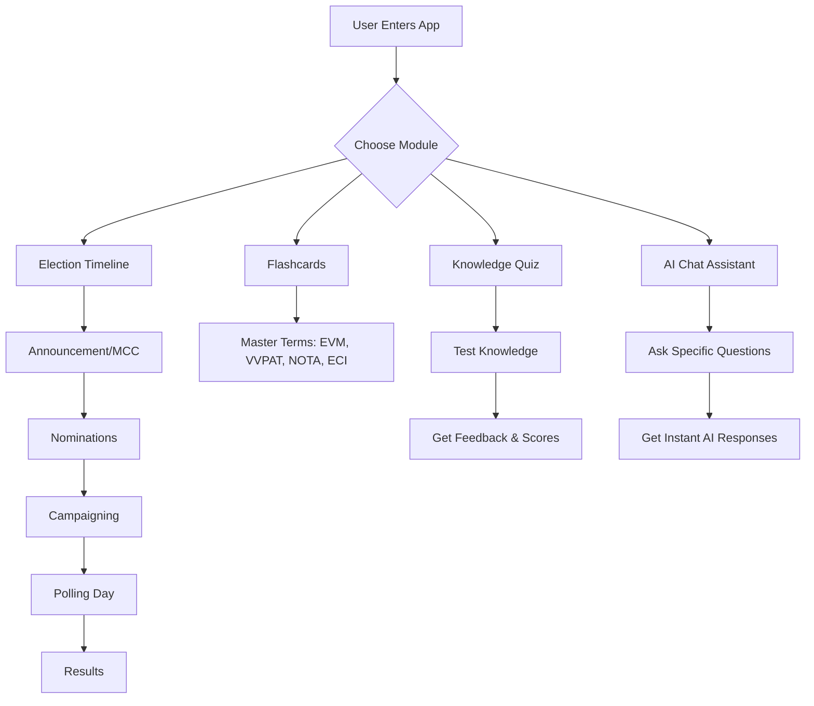

# 🇮🇳 Indian Election Assistant

An interactive, high-fidelity web application designed to educate citizens about the complexities of the Indian electoral system through a modern, engaging digital experience.

## 🌟 Project Overview
The **Indian Election Assistant** serves as a digital bridge between complex constitutional procedures and the common citizen. By leveraging modern web aesthetics and interactive learning modules, it transforms dry procedural information into a tactile and memorable experience. 

Whether you are a first-time voter or a curious citizen, this assistant helps you navigate the journey of democracy in the world's largest electoral exercise.

## 📊 Process Flow & Architecture
Below is a diagram showing how the application structures the election learning journey:

## 🚀 Key Features

### 1. Interactive Election Timeline
A visual, step-by-step roadmap that simplifies the multi-month election cycle into five critical phases. Each phase features deep-dive details and interactive expansion panels.

### 2. 3D Electoral Flashcards
Interactive cards with smooth 3D flip animations to help users master key terminology like:
- **ECI**: Election Commission of India
- **VVPAT**: Voter Verifiable Paper Audit Trail
- **NOTA**: None of the Above
- **MCC**: Model Code of Conduct

### 3. Knowledge Validation Quiz
A dynamic quiz engine with:
- Instant feedback (Correct/Incorrect indicators)
- Progress tracking
- Detailed educational explanations for every answer
- Performance scoring

### 4. Smart AI Assistant
A specialized chat interface capable of handling queries regarding:
- Voter registration steps
- Eligibility and age requirements
- The complete end-to-end election process
- Machine functions (EVM/VVPAT)

## 🛠 Tech Stack
- **Frontend**: React 18, Vite (for blazing fast development)
- **Styling**: Vanilla CSS (featuring Glassmorphism, CSS Variables, and smooth keyframe animations)
- **Icons**: Lucide React
- **Infrastructure**: Docker, NGINX
- **Deployment**: Google Cloud Run (Serverless)

## 🌐 Live Demo
The application is deployed and live at:
**[View Live App](https://indian-election-assistant-67021740548.us-central1.run.app)**

## 📦 Local Installation
1. Clone the repository
2. Install dependencies: `npm install`
3. Run dev server: `npm run dev`
